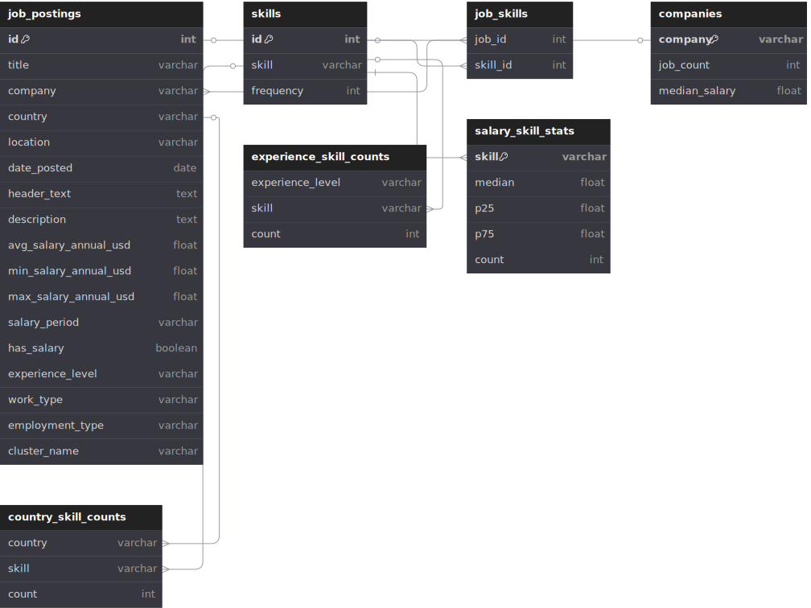
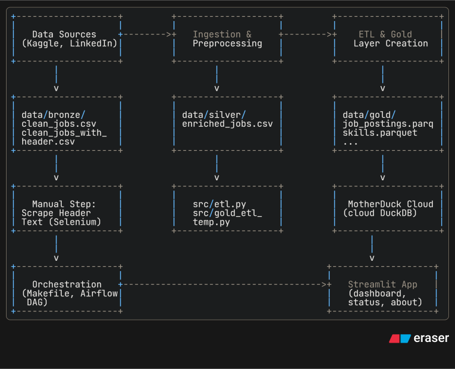
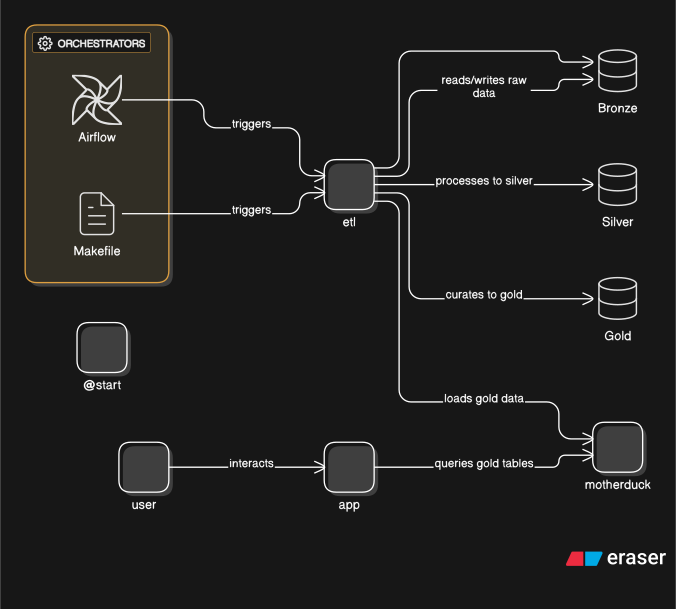
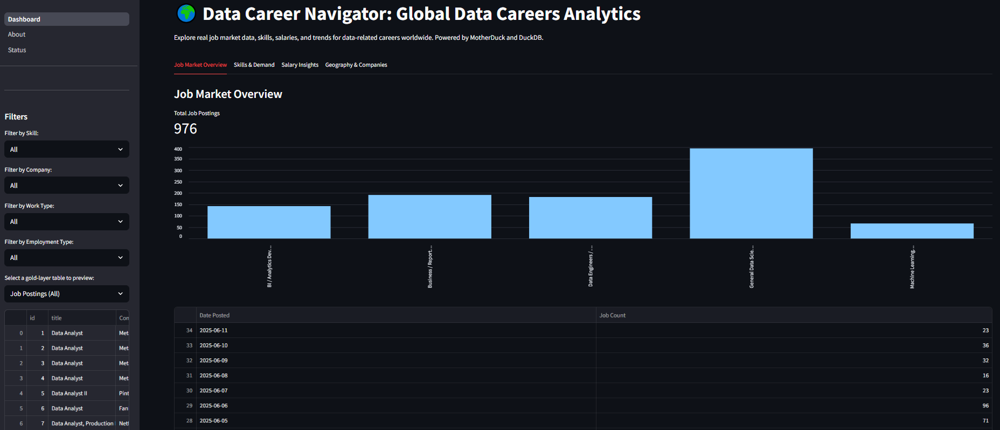

# Data Career Navigator

> **About:** A data engineering portfolio project that provides insights into career opportunities in the data industry. Utilizes a comprehensive dataset sourced from LinkedIn.


## Project Status

✅ **Complete**: This project has been successfully developed and deployed. All planned features have been implemented, and the pipeline is fully operational.

### Key Features

* **ETL Pipelin**e: Cleans, enriches, and transforms raw data into analytics-ready gold-layer tables.
* **Skill & Salary Extraction**: Extracts skills, experience, and salary information using advanced NLP and heuristics.
* **MotherDuck Integration**: Loads gold-layer data into MotherDuck for scalable analytics.
* **Interactive Dashboard**: Visualizes trends, skills, and salary insights.
* **Workflow Orchestration**: Orchestrates data pipelines using Airflow and Make.

## Overview

The [Data Career Navigator](https://data-career-navigator.streamlit.app/) is a data engineering project that aims to provide insights into career opportunities in the data industry. It leverages a comprehensive dataset sourced from LinkedIn, which includes details such as job title, company, location, date posted, and job description. The project utilizes advanced data engineering techniques to extract and analyze key insights from this dataset.
It automates data ingestion, enrichment, and gold-layer analytics. Supported by MotherDuck for scalable analytics and Airflow or Make for workflow orchestration.

**Project Title: Data Career Navigator – Exploring Data-Driven Career Opportunities**

**Problem Statement:** Despite the rapid growth of the data industry, job seekers and professionals often lack clear, data-driven insights into the evolving landscape of data-related careers. Information about required skills, salary benchmarks, experience levels, and industry trends is fragmented across various sources, making it challenging to make informed career decisions. There is a need for a unified platform that aggregates, cleans, and analyzes job market data to provide actionable insights for individuals navigating data careers.

**Project Description:** An interactive dashboard providing deep insights into career opportunities for data-related roles, utilizing a comprehensive dataset sourced from LinkedIn. Features include analysis of experience levels, salaries, key skills, job locations, and industry trends, aiding job seekers and professionals in exploring and identifying optimal career paths.

**Project Structure:**

```bash
data-career-navigator/
│
├── data/
│   ├── bronze/                        # Raw, unaltered ingestion (monthly dumps from Kaggle)
│   │   ├── clean_jobs.csv
│   │   └── clean_jobs_latest.csv
│   ├── silver/                        # Cleaned & partially enriched (after ETL)
│   │   └── enriched_jobs.csv
│   └── gold/                          # Final aggregated datasets (ready for reporting/dashboard)
│       ├── job_postings.parquet
│       ├── skills.parquet
│       ├── job_skills.parquet
│       ├── companies.parquet
│       ├── country_skill_counts.parquet
│       ├── experience_skill_counts.parquet
│       └── salary_skill_stats.parquet
│
├── notebooks/
│   ├── 01-data-cleaning.ipynb         # Ingest from data/bronze, produce silver outputs
│   ├── 02-eda-enriched-jobs.ipynb     # Explore silver tables (salary, experience, skills)
│   └── 03-visualizations.ipynb        # Prototype charts, maps, etc. using silver/gold
│
├── src/
│   ├── extractors/
│   │     ├── __init__.py
│   │     ├── salary_extractor.py      # SalaryExtractor & SalaryETL
│   │     ├── experience_extractor.py  # categorize_experience(...)
│   │     ├── skills_extractor.py      # extract_skills(job_description)
│   │     └── job_type_extractor.py    # extract_job_type(work_type, employment_type)
│   ├── webscrape.py                   # (If you scrape additional data into bronze/)
│   ├── data_ingestion.py              # Ingest clean_jobs.csv from Kaggle on monthly basis
│   ├── data_processing.py             # Helper functions: clean location, parse skills, etc.
│   └── etl.py                         # Reads from data/bronze, writes to data/silver & data/gold
│
├── airflow_dags/
│   └── etl_workflow.py                # Airflow DAG for orchestrating ETL workflow
│
├── app/
│   ├── dashboard.py                   # Streamlit main dashboard page
│   ├── utils.py                       # Shared helper functions for dashboard
│   └── pages/
│       ├── Status.py                  # Streamlit "Status" page
│       └── About.py                   # Streamlit "About" page
│
├── Makefile                           # Makefile for local workflow orchestration
├── requirements.txt                   # All Python dependencies (pandas, streamlit, airflow, etc.)
├── README.md                          # Project description, how to run ETL & app, directory conventions
├── .gitignore                         # Exclude /venv, __pycache__, data/bronze/*, etc.
└── LICENSE                            # (Apache 2.0)
```

## Datasets

1. [LinkedIn Data Jobs Dataset](https://www.kaggle.com/datasets/joykimaiyo18/linkedin-data-jobs-dataset)
    <details> <summary>Data Dictionary</summary>
        
    ### **Dataset description**
    
    A dataset of job postings for data-related roles (such as Data Analyst, Data Scientist, Data Engineer) sourced from LinkedIn. Includes key details for each job such as title, company, location, date posted, and job description, providing insights into current opportunities in the data job market.

    ### **Variable definitions**
    
    | **Name in Dataset**     | **Variable**        | **Definition** |
    | ----------------------- | ------------------- | -------------- |
    | **id (String)**         | Job ID              | Unique identifier for each job posting |
    | **title (String)**      | Job Title           | The title of the job position as listed on LinkedIn |
    | **company (String)**    | Company             | Name of the company offering the job |
    | **location (String)**   | Location            | Location of the job (may include city, state, or country) |
    | **link (String)**       | Job Posting URL     | Direct URL to the job posting on LinkedIn |
    | **source (String)**     | Source              | Platform or website where the job was sourced (e.g., LinkedIn) |
    | **date_posted (Date)**  | Date Posted         | Date when the job was posted (format: YYYY-MM-DD) |
    | **work_type (String)**  | Work Type           | Specifies if the job is Remote, On-site, or Hybrid |
    | **employment_type (String)** | Employment Type | Nature of employment (e.g., Full-time, Part-time, Contract, Internship) |
    | **description (String)**| Job Description     | Full text description of the job, including responsibilities and requirements |

    ### **Last updated:**
    
    15 May 2025, 09:00
    
    ### **Next update:**
    
    Monthly
    
    ### **Data source(s)**
    
    - LinkedIn Job Postings

    ### **URLs to dataset**
    
    - https://www.kaggle.com/datasets/joykimaiyo18/linkedin-data-jobs-dataset/download?datasetVersionNumber=2
    
    ### **License**
    
    This dataset is made available for public use under the Kaggle Datasets Terms of Service, intended for educational and research purposes. Please refer to [Kaggle Terms of Service](https://www.kaggle.com/terms) for further information.

    </details>

1. [ExchangeRate-API Daily Exchange Rates](https://www.exchangerate-api.com/)
    <details> <summary>Data Dictionary</summary>
        
    ### **Dataset description**
    
    A daily-updated dataset providing foreign exchange rates for major and minor world currencies. Rates are fetched automatically once a day using GitHub Actions, making the dataset suitable for financial analysis, currency conversion, and economic research. In our case, we use it for salary conversion during extraction process via `salary_extractor.py`.    

    ### **Variable definitions**
    
    | **Name in Dataset**     | **Variable**        | **Definition** |
    | ----------------------- | ------------------- | -------------- |
    | **base_code (String)**  | Base Currency Code  | The 3-letter ISO currency code used as the base for all exchange rates (e.g., 'USD') |
    | **target_code (String)**| Target Currency Code| The 3-letter ISO currency code for the currency being compared to the base (e.g., 'EUR') |
    | **rate (Float)**        | Exchange Rate       | The conversion rate from the base currency to the target currency |
    | **date (Date)**         | Date                | The date the exchange rates apply to, in YYYY-MM-DD format |
    | **time_last_update_utc (String)** | Last Update Time (UTC) | The date and time when the rates were last updated, in UTC (e.g., '2025-06-05T00:00:00Z') |

    ### **Last updated:**
    
    6 Jun 2025, 00:00 UTC
    
    ### **Next update:**
    
    Daily updates via GitHub Actions which is more than suffice for the purpose of this project
    
    ### **Data source(s)**
    
    - ExchangeRate-API (https://www.exchangerate-api.com/)

    ### **URLs to dataset**
    
    - JSON link on GitHub raw file [here](https://github.com/pizofreude/data-career-navigator/blob/main/src/extractors/exchange_rates_usd.json)

    ### **License**
    
    [](https://www.exchangerate-api.com/)
    
    Use of this dataset is subject to the [ExchangeRate-API Terms of Service](https://www.exchangerate-api.com/terms).  
    - Redistribution, storage, or commercial use of this data is **not permitted** without explicit written consent from ExchangeRate-API.  
    - Attribution to ExchangeRate-API is required if their data is displayed.  
    - For more details, refer to the [full Terms of Service](https://www.exchangerate-api.com/terms).

    </details>

## Data Modeling Approach

The Data Career Navigator project adopts a modern, layered data modeling strategy inspired by medallion architecture (Bronze, Silver, Gold) to ensure data quality, traceability, and analytics-readiness at every stage of the pipeline.

**1. Bronze Layer (Raw Ingestion):**
- **Purpose:** Store raw, unaltered data as ingested from external sources (e.g., Kaggle LinkedIn dataset).
- **Contents:** Files such as `clean_jobs.csv` and `clean_jobs_latest.csv` in bronze.
- **Characteristics:** Immutable, auditable, and used as the single source of truth for all downstream processing.

**2. Silver Layer (Cleaned & Enriched):**
- **Purpose:** Hold cleaned, validated, and partially enriched data.
- **Contents:** `enriched_jobs.csv` in silver, which includes standardized fields, deduplicated records, and extracted features (skills, salaries, experience, etc.).
- **Transformations:** 
  - Data cleaning (handling missing values, standardizing formats)
  - Feature extraction (NLP-based skill and salary extraction, experience categorization)
  - Location normalization and currency conversion using exchange rates

**3. Gold Layer (Analytics-Ready):**
- **Purpose:** Provide high-quality, aggregated datasets optimized for analytics, reporting, and dashboarding.
- **Contents:** Parquet files in gold such as:
  - `job_postings.parquet`
  - `skills.parquet`
  - `job_skills.parquet`
  - `companies.parquet`
  - `country_skill_counts.parquet`
  - `experience_skill_counts.parquet`
  - `salary_skill_stats.parquet`
- **Transformations:** 
  - Aggregations and joins to create fact and dimension tables
  - Calculation of skill frequencies, salary statistics, and experience distributions
  - Data is loaded into MotherDuck/DuckDB for scalable analytics

**Entity-Relationship Model:**
- The ERD (see diagram below) defines the relationships between core entities:
  - **Job Postings:** Central fact table, linked to companies, skills, and locations
  - **Skills:** Dimension table, linked via a many-to-many relationship with job postings
  - **Companies:** Dimension table, providing company-level analytics
  - **Aggregated Tables:** Precomputed statistics for country, experience, and salary insights

**Best Practices:**
- All transformations are performed using reproducible ETL scripts and orchestrated via Airflow or Make.
- Data lineage is maintained from raw ingestion to gold outputs.
- The model is designed for extensibility, allowing new data sources or features to be integrated with minimal disruption.

The Entity Relational Diagram (ERD):

<center>



</center>

## Tech Stacks and Architecture

The Data Career Navigator leverages a modern, modular data engineering stack to ensure reliability, scalability, and maintainability across the entire analytics workflow.

**Data Pipeline:**  
- **Batch ETL:** Automated, scheduled batch jobs ingest, clean, enrich, and transform job market data from external sources into analytics-ready datasets.

**Orchestration:**  
- **Apache Airflow & Make:** Workflow orchestration is managed using Airflow DAGs for production-grade scheduling, monitoring, and dependency management, with Makefiles supporting local development and ad-hoc runs.

**Data Storage & Lakehouse:**  
- **Layered Data Lake:**  
  - **Bronze Layer:** Raw data ingested from Kaggle and other sources, stored as immutable CSVs.
  - **Silver Layer:** Cleaned and enriched data, with standardized fields and extracted features.
  - **Gold Layer:** Aggregated, analytics-ready Parquet files optimized for reporting and dashboarding.
- **MotherDuck/DuckDB:** Gold-layer data is loaded into MotherDuck (cloud DuckDB) for scalable, serverless analytics and fast SQL querying.

**Data Transformation & Enrichment:**  
- **Python ETL Scripts:** All data cleaning, enrichment (NLP-based skill and salary extraction, experience categorization), and transformation logic is implemented in modular Python scripts.
- **Pandas, NumPy, Scikit-learn:** Used for data wrangling, feature engineering, and statistical analysis.

**Analytics & Visualization:**  
- **Streamlit:** Interactive dashboards are built with Streamlit, providing real-time exploration of trends, skills, salaries, and company insights.
- **Plotly:** Advanced visualizations (heatmaps, time series, skill distributions) are rendered using Plotly for rich, interactive analytics.

**Supporting Tools:**  
- **Kaggle API:** Automated data downloads and updates from the LinkedIn dataset.
- **ExchangeRate-API:** Daily currency rates for salary normalization.
- **Jupyter Notebooks:** Used for exploratory data analysis (EDA), prototyping, and documentation.

**Infrastructure & DevOps:**  
- **Reproducibility:** All dependencies are managed via requirements.txt, and workflows are version-controlled in Git.
- **Scalability:** The architecture is designed to scale from local development to cloud-based analytics with minimal changes.
- **Documentation:** Architecture and ERD diagrams are included for transparency and onboarding.

**Architecture Diagram:**  
- The following diagrams illustrate the end-to-end data flow, from ingestion to dashboarding, and the relationships between core entities and processing layers.

<center>





</center>

## Data Career Navigator Dashboard

Built with Streamlit, it enables users to explore real job market data, skills, salaries, and trends for data-related careers worldwide, powered by MotherDuck and DuckDB for fast, scalable analytics.

**Key Features:**
- **Job Market Overview:** Instantly see the total number of job postings, with breakdowns by role, company, and posting date.
- **Dynamic Filtering:** Filter job postings by skill, company, work type (remote, on-site, hybrid), and employment type (full-time, part-time, contract, internship).
- **Gold-Layer Table Previews:** Select and preview any gold-layer analytics table (e.g., job postings, skills, salary stats) directly in the dashboard.
- **Skills & Demand:** Visualize the most in-demand skills, their frequency, and how they relate to job titles and companies.
- **Salary Insights:** Analyze salary distributions, compare compensation across roles, and view salary trends by skill or geography.
- **Geography & Companies:** Explore hiring trends by country, city, and company, with interactive maps and company leaderboards.
- **Responsive UI:** Built for usability, with a modern dark theme and intuitive navigation.

**Live Dashboard:**
Access the live dashboard here: [data-career-navigator.streamlit.app](https://data-career-navigator.streamlit.app/)

**Dashboard Preview:**



The dashboard empowers job seekers, professionals, and analysts to:
- Identify high-demand skills and roles in the data industry
- Benchmark salaries and experience requirements
- Discover top hiring companies and locations
- Make data-driven career decisions with confidence

All analytics are powered by the gold-layer datasets generated by the ETL pipeline, ensuring up-to-date and reliable insights.

## Getting Started

Follow these steps to set up, run, and explore the Data Career Navigator project on your local machine or cloud environment.

### 1. Prerequisites
- **Python 3.10+** (recommended)
- **pip** (Python package manager)
- **Git** (for cloning the repository)
- **Kaggle account** (for dataset access)
- **ExchangeRate-API key** (for currency conversion)

### 2. Clone the Repository
```bash
git clone https://github.com/pizofreude/data-career-navigator.git
cd data-career-navigator
```

### 3. Set Up Python Environment
It is recommended to use a virtual environment:
```bash
python -m venv venv
source venv/bin/activate  # On Windows: venv\Scripts\activate
```

### 4. Install Dependencies
```bash
pip install -r requirements.txt
```

### 5. Configure Kaggle API (for Data Ingestion)
- Create a Kaggle account and generate an API token from your [Kaggle account settings](https://www.kaggle.com/settings/account).
- Place the downloaded `kaggle.json` file in `~/.kaggle/` (Linux/Mac) or `%USERPROFILE%\.kaggle\` (Windows).
- Ensure the file has correct permissions (readable only by you).

### 6. Download the Raw Dataset
Run the data ingestion script to fetch the latest LinkedIn job postings dataset:
```bash
python src/data_ingestion.py
```
This will download and update `data/bronze/clean_jobs_latest.csv`.

### 7. (Optional) Set Up Exchange Rate API Key
- Register at [exchangerate-api.com](https://www.exchangerate-api.com/) to obtain a free API key.
- Add your API key as a GitHub secret or environment variable if you wish to automate daily updates (see `src/extractors/README.md` for GitHub Actions setup).

### 8. Run the ETL Pipeline
Transform and enrich the data from bronze to gold layers:
```bash
python src/etl.py
```
This will generate cleaned and analytics-ready datasets in `data/silver/` and `data/gold/`.

### 9. Launch the Dashboard
Start the Streamlit dashboard locally:
```bash
streamlit run app/Dashboard.py
```
- The dashboard will be available at [http://localhost:8501](http://localhost:8501)
- Explore job market trends, skills, salaries, and more interactively.

### 10. (Optional) Orchestrate with Airflow
- To run the ETL pipeline on a schedule, set up Apache Airflow and use the provided DAG in `airflow_dags/etl_workflow.py`.
- For local development, you can also use the `Makefile` for common tasks.

### Using Make for Workflow Automation

The project includes a `Makefile` to streamline and automate common ETL and data update tasks. This is especially useful for local development, testing, and running the pipeline end-to-end. Below are the available Make targets and the recommended order of execution:

#### 1. Update Exchange Rate Data
Fetch the latest code and (optionally) update exchange rate data:
```bash
make update-exchange-rate
```
This will pull the latest changes from the repository. (You may also update exchange rates if configured.)

#### 2. Data Ingestion
Download the latest LinkedIn job postings dataset from Kaggle:
```bash
make run-data-ingestion
```
This will run the data ingestion script and update `data/bronze/clean_jobs_latest.csv`.

#### 3. (Manual) Scrape Header Text (if needed)
Some job postings may require manual header scraping due to LinkedIn restrictions:
```bash
make scrape-header
```
This will prompt you to run the Selenium-based script manually. Follow the instructions in the terminal (manual LinkedIn login required).

#### 4. Run Local ETL Pipeline
Transform and enrich the data from bronze to gold layers locally:
```bash
make run-etl-local
```
This will generate cleaned and analytics-ready datasets in `data/silver/` and `data/gold/`.

#### 5. Load Gold Data to MotherDuck (Cloud Analytics)
Upload the gold-layer Parquet files to MotherDuck for scalable analytics:
```bash
make run-etl-motherduck
```

#### 6. Full Workflow (Recommended for Local Development)
To run all steps (except the manual header scraping) in sequence:
```bash
make full
```
This will execute all the above steps in the correct order, pausing for manual header scraping if needed.

---
**Tip:**
- You can always inspect or modify the `Makefile` to customize workflow steps for your environment.
- For production or scheduled runs, consider using Airflow with the provided DAGs.


### 11. Explore Notebooks
- Jupyter notebooks in `notebooks/` provide step-by-step EDA, data cleaning, and advanced analytics.
- Launch with:
```bash
jupyter lab
```

### 12. Access the Live Dashboard
- Visit the hosted dashboard at: [data-career-navigator.streamlit.app](https://data-career-navigator.streamlit.app/)

---

**For more details:**
- See the [README.md](README.md) and code comments for further documentation.


## Contributions and Feedback

For troubleshooting or contributing, open an issue or pull request on GitHub.

We welcome contributions to the Data Career Navigator project. Here's how you can help:

### Bug Reports & Feature Requests
- Search existing [issues](https://github.com/pizofreude/data-career-navigator/issues) before creating a new one
- Open a new issue with a clear title and detailed description
- Include steps to reproduce bugs and expected behavior
- Tag issues appropriately (bug, enhancement, documentation, etc.)

### Pull Requests
1. Fork the repository
2. Create a new branch (`git checkout -b feature/amazing-feature`)
3. Make your changes
4. Run tests and linting
5. Commit with clear messages (`git commit -m 'Add amazing feature'`)
6. Push to your branch (`git push origin feature/amazing-feature`)
7. Open a Pull Request

### Development Guidelines
- Follow PEP 8 style guide for Python code
- Add tests for new features
- Update documentation as needed
- Keep commits atomic and well-described

### Questions & Feedback
- Join our [Discussions](https://github.com/pizofreude/data-career-navigator/discussions)
- Ask questions and share ideas
- Provide feedback on features and documentation

Please read our [Code of Conduct](CODE_OF_CONDUCT.md) before contributing.

## License

This project is licensed under the Apache 2.0 License. See the [LICENSE](https://www.notion.so/pizofreude/LICENSE) file for details.


